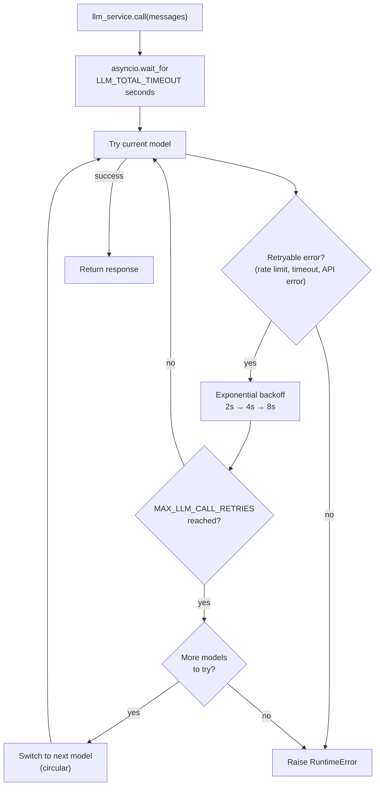

# LLM Service

## Overview

The LLM service (`app/services/llm/`) handles all language model calls with automatic retries, circular model fallback, and a total timeout budget. Your agent code calls `llm_service.call(messages)` — the service handles everything else.

The package is split into two modules:

- `app/services/llm/registry.py` — `LLMRegistry`: defines available models
- `app/services/llm/service.py` — `LLMService`: call logic, retries, fallback, structured output

## Model registry

Models are defined in `LLMRegistry.LLMS` in order of preference:

| Name | Model | Notes |
| --- | --- | --- |
| `deepseek-v4-flash` | `deepseek-v4-flash` | Default official DeepSeek chat model. |

Set `DEFAULT_LLM_MODEL` in your `.env` to choose the starting model.

To add or change models, edit `LLMRegistry.LLMS` in `app/services/llm/registry.py`.

## Retry and fallback behaviour



**Retry config** (per model):

- Max attempts: `MAX_LLM_CALL_RETRIES` (default: 3)
- Wait: exponential backoff, 2s min, 10s max
- Retries on: `RateLimitError`, `APITimeoutError`, `APIError`

**Total timeout**: `LLM_TOTAL_TIMEOUT` seconds (default: 60s) caps the entire loop. Without this, worst case is `retries × models × max_wait` — potentially 2+ minutes.

**Fallback order**: circular through `LLMRegistry.LLMS`. The current registry contains only DeepSeek V4 Flash, so failures are retried on that model and then returned to the caller. Add another compatible model entry to enable cross-model fallback.

## Tools

Tools are bound to the LLM at startup:

```python
llm_service.bind_tools(tools)
```

When a model is switched during fallback, the tools are re-bound to the new model automatically.

## Structured output

Pass a Pydantic model as `response_format` to get a validated instance back instead of a raw `BaseMessage`:

```python
from app.schemas.my_schema import MySchema

result: MySchema = await llm_service.call(
    messages,
    model_name="deepseek-v4-flash",  # optional
    response_format=MySchema,
    temperature=0.2,
)
```

The service chains `.with_structured_output(schema)` on the resolved model and re-wraps it on every fallback attempt, so retries and model switching work transparently.

## Adding a new model

```python
# app/services/llm/registry.py — LLMRegistry.LLMS
{
    "name": "another-compatible-model",
    "llm": ChatOpenAI(
        model="another-compatible-model",
        api_key=settings.DEEPSEEK_API_KEY,
        base_url=settings.DEEPSEEK_BASE_URL,
        max_tokens=settings.MAX_TOKENS,
    ),
},
```

Add it at any position in the list. The fallback order follows the list order.
