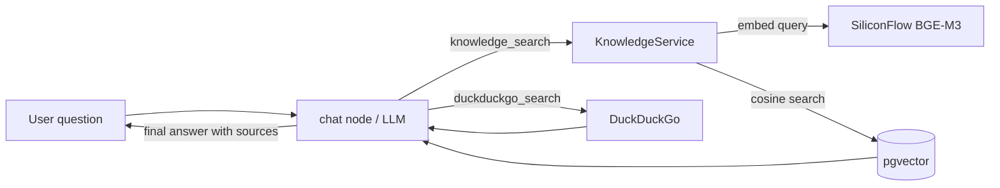

# RAG Knowledge Base Q&A

The agent answers questions with a **retrieval-augmented generation (RAG)** flow:

1. The LLM decides whether the question needs the knowledge base and calls the `knowledge_search` tool.
2. The query is embedded with a free embedding model and matched against chunks stored in **pgvector** (cosine similarity, HNSW index).
3. Retrieved passages are injected into the conversation as context with sources.
4. If the knowledge base has nothing useful, the agent falls back to **DuckDuckGo web search** (`duckduckgo_search` tool), then to its own knowledge.

## Architecture



## Components

| Component | File | Responsibility |
|---|---|---|
| Knowledge Service | `app/services/knowledge.py` | Embedding, pgvector storage, similarity search |
| Agent tool | `app/core/langgraph/tools/knowledge_search.py` | Exposes retrieval to the LLM |
| Chunk schemas | `app/schemas/knowledge.py` | `DocumentChunk` / `KnowledgeHit` models |
| Ingestion CLI | `scripts/ingest_docs.py` | Load documents, chunk, embed, store |
| Table migration | `alembic/versions/7f3a9c1d2b4e_add_knowledge_chunks.py` | `knowledge_chunks` table + HNSW index |

## Setup

1. **Configure the embedding API** (free — SiliconFlow SiliconCloud):

   ```env
   # .env.development
   SILICONFLOW_API_KEY=<your-free-key>   # https://cloud.siliconflow.cn/account/ak
   EMBEDDING_MODEL=BAAI/bge-m3           # free model, 1024 dims
   ```

2. **Start the database and run migrations**:

   ```bash
   make docker-up     # or your local PostgreSQL with pgvector
   make migrate
   ```

3. **Ingest your documents** (`.md`, `.txt`, `.rst` — files or directories):

   ```bash
   make ingest DOC="docs/"                    # ingest a directory
   uv run python scripts/ingest_docs.py notes/guide.md --chunk-size 500
   uv run python scripts/ingest_docs.py docs/ --reset   # wipe and re-ingest
   ```

4. **Start the API**:

   ```bash
   make dev
   ```

   Then ask the agent something covered by your documents — it should retrieve
   passages and answer with sources.

## Configuration

| Variable | Default | Description |
| --- | --- | --- |
| `SILICONFLOW_API_KEY` | *(empty)* | SiliconFlow key for free embeddings |
| `SILICONFLOW_BASE_URL` | `https://api.siliconflow.cn/v1` | OpenAI-compatible endpoint |
| `EMBEDDING_MODEL` | `BAAI/bge-m3` | Embedding model (1024 dims) |
| `EMBEDDING_DIM` | `1024` | Vector dimension — must match the model |
| `EMBEDDING_TIMEOUT` | `30` | Per-request embedding timeout (seconds) |
| `EMBEDDING_BATCH_SIZE` | `64` | Texts per embedding API request |
| `KNOWLEDGE_TABLE` | `knowledge_chunks` | pgvector table name |
| `KNOWLEDGE_TOP_K` | `5` | Passages returned per search |
| `KNOWLEDGE_MIN_SIMILARITY` | `0.3` | Cosine cutoff for retrieval |
| `KNOWLEDGE_CHUNK_SIZE` | `800` | Chunk size used by the ingest script |
| `KNOWLEDGE_CHUNK_OVERLAP` | `100` | Chunk overlap used by the ingest script |

## Notes & gotchas

- **Source replacement is atomic.** Re-ingesting a file embeds the new chunks
  first, then replaces all old chunks for that source in one transaction. An
  embedding failure therefore leaves the last searchable version untouched,
  and edited files do not leave stale chunks behind.
- **Changing the embedding model invalidates old vectors.** Different models
  produce incompatible vector spaces. Re-ingest with `--reset` after changing
  `EMBEDDING_MODEL`.
- **`EMBEDDING_DIM` must match the model.** If you switch to a model with a
  different dimension, update the migration / recreate the table. The Alembic
  migration is deliberately closed (hardcoded table name and dimension), so
  keep `KNOWLEDGE_TABLE` / `EMBEDDING_DIM` at their defaults unless you create
  the table yourself.
- **The migration runs `CREATE EXTENSION IF NOT EXISTS vector`** — fine on the
  bundled `pgvector/pgvector:pg16` image, but managed PostgreSQL (RDS,
  Supabase…) may require superuser; enable the extension there manually.
- **Missing API key degrades gracefully.** Without `SILICONFLOW_API_KEY` the
  `knowledge_search` tool tells the agent to fall back to web search instead
  of crashing the conversation.
- **Embedding calls use the local tracing layer**, are retried with tenacity,
  and are bounded by `EMBEDDING_TIMEOUT`.
- **PDF support** is not built in (avoids extra dependencies). Add `pypdf`
  and a loader in `scripts/ingest_docs.py` if you need it.
