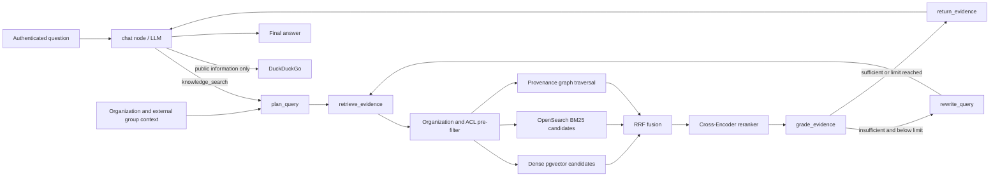

# RAG Knowledge Base Q&A

The agent answers questions with an ACL-aware **hybrid retrieval-augmented generation (RAG)** flow:

1. The server resolves organization membership and external group mappings for the authenticated user.
2. A structured Query Planner produces bounded subqueries, entity names and narrowing space filters.
3. PostgreSQL, OpenSearch and the provenance graph apply organization/user/group ACL predicates.
4. Dense pgvector, strict OpenSearch BM25 and graph candidates are fused with RRF.
5. A SiliconFlow Cross-Encoder reranks the fused shortlist when enabled.
6. An evidence evaluator either accepts the evidence or emits at most three rewrites; retrieval stops after the configured loop limit.
7. Retrieved passages are injected as untrusted evidence with stable source IDs.
8. Missing internal evidence fails closed; public web search is reserved for explicitly public information.

## Architecture



## Components

| Component | File | Responsibility |
|---|---|---|
| Agentic RAG workflow | `app/core/langgraph/rag_workflow.py` | Explicit Plan → Retrieve → Grade → Rewrite/Return state graph |
| Knowledge Service | `app/services/knowledge.py` | Spaces, ACLs, normalized ingestion and hybrid retrieval |
| Agent tool | `app/core/langgraph/tools/knowledge_search.py` | Exposes retrieval while consuming server-injected identity |
| Schemas | `app/schemas/knowledge.py` | Chunks, hits and trusted `RetrievalContext` |
| Ingestion CLI | `scripts/ingest_docs.py` | Load documents, chunk, embed, store |
| Connector sync CLI | `scripts/sync_knowledge.py` | Register, run and reindex durable connectors |
| Connector contract | `app/services/connectors/base.py` | Normalized documents, tombstones and durable cursors |
| Sync orchestrator | `app/services/knowledge_sync.py` | Cursor settlement, chunking, updates and delete propagation |
| BM25 index | `app/services/search_index.py` | OpenSearch mapping, bulk indexing, ACL search and PostgreSQL hydration IDs |
| Reranker | `app/services/reranker.py` | SiliconFlow Cross-Encoder with bounded fail-open behavior |
| Query Planner | `app/services/query_planner.py` | Structured intent, subqueries, entities and safe space narrowing |
| Evidence evaluator | `app/services/evidence_evaluator.py` | Sufficiency decision and bounded query rewrites |
| Retrieval pipeline | `app/services/retrieval_pipeline.py` | Reusable planning, Hybrid/KG search, grading and final fusion operations |
| Knowledge Graph | `app/services/knowledge_graph.py` | Entity/relation extraction, provenance and ACL traversal |
| Product workflows | `app/services/knowledge_workflows.py` | Citation-validated Research and Wiki generation |
| Organization access | `app/services/knowledge_access.py` | Server-owned tenant/group retrieval context |
| External ACL sync | `app/services/external_acl.py` | Provider principal mappings and document ACL snapshots |
| Connector vault | `app/services/connector_credentials.py` | AES-GCM provider-token storage with connector-bound AAD |
| Scheduled sync | `app/services/knowledge_sync_worker.py` | Due-time background connector dispatch |
| Base migration | `alembic/versions/7f3a9c1d2b4e_add_knowledge_chunks.py` | Original chunk table + HNSW index |
| Enterprise migration | `alembic/versions/e41a8c7d2f90_add_enterprise_knowledge_acl.py` | Spaces, documents, ACLs and lexical GIN index |
| Connector migration | `alembic/versions/f27c6e9a4b31_add_knowledge_connector_sync.py` | Connectors, cursors and content-free sync runs |
| Graph migration | `alembic/versions/a13f8d4c7e52_add_provenance_knowledge_graph.py` | Space-scoped entities and chunk-backed relations |
| Tenant migration | `alembic/versions/c35b7e1f9a64_add_organizations_and_external_acl.py` | Organizations, groups, mappings and encrypted connector secrets |

## Setup

1. **Configure the embedding API** (free — SiliconFlow SiliconCloud):

   ```env
   # .env.development
   SILICONFLOW_API_KEY=<your-free-key>   # https://cloud.siliconflow.cn/account/ak
   EMBEDDING_MODEL=BAAI/bge-m3           # free model, 1024 dims
   ```

2. **Start the database and run migrations**:

   ```bash
   make docker-up     # or your local PostgreSQL with pgvector
   make docker-migrate
   ```

3. **Start strict BM25 for development** (optional but recommended):

   ```bash
   docker compose --env-file .env.development --profile search up -d opensearch
   # Host-run API:
   # OPENSEARCH_URL=http://127.0.0.1:9200
   ```

   The Compose profile disables OpenSearch security and binds it to localhost.
   Never use that configuration for a remote or production deployment.

4. **Ingest public documents** (`.md`, `.txt`, `.rst` — files or directories):

   ```bash
   make ingest DOC="docs/"                    # ingest a directory
   uv run python scripts/ingest_docs.py notes/guide.md --chunk-size 500
   uv run python scripts/ingest_docs.py docs/ --reset   # wipe and re-ingest
   uv run python scripts/ingest_docs.py docs/ --space default-public
   ```

5. **Or register an incremental local connector**:

   ```bash
   uv run python scripts/sync_knowledge.py register-local docs --space default-public --name project-docs
   uv run python scripts/sync_knowledge.py sync 1
   uv run python scripts/sync_knowledge.py reindex --space default-public
   ```

   Re-running `sync` emits only content changes and source tombstones. The
   durable cursor advances only after PostgreSQL and the configured external
   index both succeed.

   Provider connectors read tokens from environment variables and immediately
   store them encrypted; tokens are never persisted in connector `config`:

   ```bash
   uv run python scripts/sync_knowledge.py register-github \
     --owner acme --repository handbook --name github-handbook
   uv run python scripts/sync_knowledge.py register-notion \
     --workspace-external-id workspace-id --name notion-wiki
   uv run python scripts/sync_knowledge.py register-sharepoint \
     --drive-id drive-id --name sharepoint-drive
   ```

   Defaults: `GITHUB_CONNECTOR_TOKEN`, `NOTION_CONNECTOR_TOKEN` and
   `SHAREPOINT_CONNECTOR_TOKEN`. Set
   `CONNECTOR_CREDENTIAL_ENCRYPTION_KEY` to a separate platform key first.

6. **Build the provenance graph** (this invokes an LLM and may consume quota):

   ```bash
   uv run python scripts/build_knowledge_graph.py --space default-public --user-id 1
   ```

7. **Configure organizations and tenant spaces**:

   ```bash
   uv run python scripts/manage_organizations.py create acme "Acme"
   uv run python scripts/manage_organizations.py add-member acme 1 --role owner
   uv run python scripts/manage_organizations.py create-space acme engineering "Engineering" --owner-user-id 1
   ```

   Provider identities that are not emails, such as GitHub logins, can be
   explicitly mapped without weakening the organization boundary:

   ```bash
   uv run python scripts/sync_knowledge.py map-user 3 octocat 1
   uv run python scripts/sync_knowledge.py add-group-member 4 engineering-group 1
   ```

8. **Start the API**:

   ```bash
   make dev
   ```

   Then ask the agent something covered by your documents — it should retrieve
   passages and answer with sources.

   Research and Wiki use the same Planner, ACL, Hybrid/KG and evaluator chain:

   ```text
   POST /api/v1/knowledge/research
   POST /api/v1/knowledge/wiki
   {"query": "deployment architecture", "space_slugs": ["engineering"]}
   ```

## Configuration

| Variable | Default | Description |
| --- | --- | --- |
| `SILICONFLOW_API_KEY` | *(empty)* | SiliconFlow key for free embeddings |
| `SILICONFLOW_BASE_URL` | `https://api.siliconflow.cn/v1` | OpenAI-compatible endpoint |
| `EMBEDDING_MODEL` | `BAAI/bge-m3` | Embedding model (1024 dims) |
| `EMBEDDING_DIM` | `1024` | Vector dimension — must match the model |
| `EMBEDDING_TIMEOUT` | `30` | Per-request embedding timeout (seconds) |
| `EMBEDDING_BATCH_SIZE` | `64` | Texts per embedding API request |
| `KNOWLEDGE_TABLE` | `knowledge_chunks` | pgvector table name |
| `KNOWLEDGE_DEFAULT_SPACE` | `default-public` | Compatibility space for existing/local public documents |
| `KNOWLEDGE_TOP_K` | `5` | Passages returned per search |
| `KNOWLEDGE_DENSE_CANDIDATES` | `50` | ACL-filtered dense candidates before fusion |
| `KNOWLEDGE_LEXICAL_CANDIDATES` | `50` | ACL-filtered lexical candidates before fusion |
| `KNOWLEDGE_RRF_K` | `60` | RRF rank constant |
| `KNOWLEDGE_MIN_SIMILARITY` | `0.3` | Cosine cutoff for retrieval |
| `KNOWLEDGE_CHUNK_SIZE` | `800` | Chunk size used by the ingest script |
| `KNOWLEDGE_CHUNK_OVERLAP` | `100` | Chunk overlap used by the ingest script |
| `OPENSEARCH_URL` | *(empty)* | Enables strict BM25; empty uses PostgreSQL FTS fallback |
| `OPENSEARCH_INDEX` | `qaagent-knowledge-v1` | Versioned chunk index name |
| `OPENSEARCH_VERIFY_SSL` | `true` | Verify OpenSearch TLS certificates |
| `OPENSEARCH_TIMEOUT` | `5` | OpenSearch request timeout |
| `RERANK_ENABLED` | `false` | Enable the external Cross-Encoder reranker |
| `RERANK_MODEL` | `BAAI/bge-reranker-v2-m3` | SiliconFlow reranking model |
| `RERANK_CANDIDATES` | `20` | RRF candidates sent to the reranker |
| `RERANK_TIMEOUT` | `8` | Reranker request timeout before fused-order fallback |
| `RETRIEVAL_MAX_LOOPS` | `2` | Hard limit for evaluate → rewrite → retrieve rounds |
| `KNOWLEDGE_GRAPH_MAX_CHUNKS` | `20` | Maximum chunks sent during one graph extraction |
| `CONNECTOR_CREDENTIAL_ENCRYPTION_KEY` | *(empty)* | Separate platform master key for provider tokens |
| `KNOWLEDGE_SYNC_WORKER_ENABLED` | `false` | Enable scheduled connector polling |
| `KNOWLEDGE_SYNC_POLL_SECONDS` | `5` | Due-connector polling interval |

## Notes & gotchas

- **Existing data is preserved.** The enterprise migration moves legacy chunks
  into a public `default-public` space and creates normalized document rows.
- **ACL filtering happens before ranking.** A private document is eligible only
  when its space or document ACL includes the authenticated user/group. The LLM
  never receives an argument with which it can choose the authenticated user.
- **Source identity is space-scoped.** Replacing `handbook.md` in one space no
  longer deletes another space's document with the same source name.
- **Source replacement remains atomic.** Re-ingesting a file embeds the new chunks
  first, then replaces all old chunks for that source in one transaction. An
  embedding failure therefore leaves the last searchable version untouched,
  and edited files do not leave stale chunks behind.
- **Changing the embedding model invalidates old vectors.** Different models
  produce incompatible vector spaces. Re-ingest with `--reset` after changing
  `EMBEDDING_MODEL`.
- **`EMBEDDING_DIM` must match the model.** If you switch to a model with a
  different dimension, update the migration / recreate the table. The Alembic
  migration is deliberately closed (hardcoded table name and dimension), so
  keep `KNOWLEDGE_TABLE` / `EMBEDDING_DIM` at their defaults unless you create
  the table yourself.
- **The migration runs `CREATE EXTENSION IF NOT EXISTS vector`** — fine on the
  bundled `pgvector/pgvector:pg16` image, but managed PostgreSQL (RDS,
  Supabase…) may require superuser; enable the extension there manually.
- **Missing internal evidence fails closed.** Without an embedding key or an
  authorized hit, the agent must not invent internal facts from model knowledge.
- **Embedding calls use the local tracing layer**, are retried with tenacity,
  and are bounded by `EMBEDDING_TIMEOUT`.
- **OpenSearch is defense-in-depth filtered.** ACL principals are part of the
  OpenSearch bool filter, and returned chunk IDs are hydrated through a second
  PostgreSQL ACL predicate before RRF. A stale external ACL cannot expose text.
- **OpenSearch is optional.** Connection/search failures fall back to the
  PostgreSQL lexical branch without disabling dense retrieval.
- **Reranking is fail-open.** Invalid indices, timeouts and provider errors keep
  the RRF order. The provider response is requested without returned documents.
- **PDF support** is not built in (avoids extra dependencies). Add `pypdf`
  and a loader in `scripts/ingest_docs.py` if you need it.

## Current boundary and next phases

Implemented provider adapters are GitHub REST tree/content/collaborators, Notion
page search/block traversal, and Microsoft Graph drive delta/content/permissions.
SharePoint delta tombstones and Notion/GitHub pagination are consumed before the
durable cursor advances. Notion's public API exposes content shared with a
connection rather than a complete per-user page ACL; QAagent therefore models
that as a connection-scoped external group which must be mapped to local members.

Still pending: OAuth authorization-code/token-refresh UI, Confluence/Slack/
database adapters, automatic Microsoft/Notion directory membership expansion,
and frontend screens for Research/Wiki/organization administration. Static PAT
or access-token connectors, encrypted storage, external ACL snapshots, scheduled
dispatch, Planner/evaluator loops, KG traversal and backend Research/Wiki APIs
are implemented.
